# Architecture

## Trust model

The generated translation is a draft, not an authoritative religious text. Trust is established by
the mosque's source policy and qualified reviewer, not by a model confidence score.

```mermaid
flowchart LR
    A["Mosque admin uploads trusted PDF or DOCX"] --> B["Validate file, then extract and chunk text"]
    C["Mosque admin uploads Arabic khutba PDF or DOCX"] --> D["Extract text or run bounded local Arabic OCR"]
    D --> R["SOURCE_REVIEW_REQUIRED: mosque corrects and confirms Arabic"]
    B --> E["Retrieve bounded source excerpts"]
    R --> E
    R --> C1["Match Qur'an verses and exact hadith references"]
    C1 --> C2["Retrieve canonical English wording from Quran.com / Sunnah.com"]
    C2 --> E
    E --> F["Translation provider returns structured draft + source IDs"]
    F --> G["Verifier compares Arabic, translation, and excerpts"]
    G --> H["REVIEW_REQUIRED"]
    H --> I["Qualified reviewer edits and approves every segment"]
    I --> J["PUBLISHED"]
    J --> K["Authenticated readers"]
```

Only the transition from `REVIEW_REQUIRED` to `PUBLISHED` makes content visible to readers. The API
checks that every segment is `HUMAN_APPROVED`; Android cannot bypass this server-side rule.

## Backend layers

- `app/api/routes`: JSON/multipart HTTP contracts and authorization boundaries.
- `app/models`: mosque, user, source, sermon, segment, and state records.
- `app/services/documents.py`: bounded PDF/DOCX upload, signature validation, text extraction,
  Arabic check, segmentation, and storage.
- `app/services/ocr.py`: local Poppler rendering and Arabic Tesseract OCR with page/time limits.
- `app/services/retrieval.py`: mosque-scoped trusted-chunk retrieval.
- `app/services/canonical_sources.py`: exact Qur'an matching, explicit hadith-reference detection,
  backend-only Quran.com/Sunnah.com clients, and safe reviewer warnings.
- `app/services/providers`: translation/verifier abstraction and OpenAI/open-model implementations.
- `app/services/translation.py`: background state machine and audit persistence.

The uploaded file is never sent to OpenAI or an OpenAI-compatible server. The provider receives only
the current extracted Arabic segment and a small set of extracted excerpts. Canonical excerpts from
Quran.com and Sunnah.com are marked separately, linked directly, and must not be re-translated when
their full Arabic quotation is matched. It is instructed to cite only supplied chunk IDs. The server
discards invented IDs, adds detected canonical citations deterministically, and flags a segment that
has no valid citation. The verifier runs as a separate request and may use
`KHUTBA_VERIFIER_MODEL` to separate the draft and checking models.

## API surface

| Actor | Endpoint | Purpose |
| --- | --- | --- |
| Anyone | `POST /api/v1/auth/register` | Create reader account only |
| Anyone | `POST /api/v1/auth/login` | Receive short-lived bearer token |
| Reader | `GET /api/v1/reader/mosques` | Choose mosque |
| Reader | `GET /api/v1/reader/mosques/{id}/sermons` | List only published khutbas |
| Reader | `GET /api/v1/reader/sermons/{id}` | Read reviewed segments and references |
| Admin | `POST /api/v1/admin/sources` | Add mosque-scoped trusted PDF/DOCX |
| Admin | `POST /api/v1/admin/sermons` | Add and segment Arabic khutba PDF/DOCX |
| Admin | `PUT /api/v1/admin/sermons/{id}/source-text` | Correct and confirm extracted Arabic |
| Admin | `POST /api/v1/admin/sermons/{id}/translate` | Start grounded draft job |
| Admin | `PATCH /api/v1/admin/sermons/{id}/segments/{id}` | Edit/approve one segment |
| Admin | `POST /api/v1/admin/sermons/{id}/publish` | Publish only fully approved sermon |

## Provider substitution

`TranslationProvider` has two required operations: `translate` and `verify`. The OpenAI adapter uses
structured Pydantic output from the Responses API. The compatible adapter uses Chat Completions with
a JSON schema included in the prompt, which works with many local gateways but needs model-specific
evaluation.

Provider substitution does not change the database, API, or Android client. It also does not relax
the review gate.

## Current deliberate limitations

- Text PDFs and DOCX files are supported. Scanned khutba PDFs require local Poppler, Tesseract, and
  the `ara` language data; OCR output must pass mosque review before translation.
- Background tasks run in the API process. Production should move translation to a durable queue.
- SQLite and automatic table creation are for development. Production needs PostgreSQL and versioned
  migrations.
- Mosque-owned retrieval is lexical. Qur'an matching combines normalized full-verse matching with
  bounded partial matching for cue-following, quoted, or sufficiently vocalized passages. Formatting
  never establishes a Qur'an citation without a match to the Arabic catalog. Hadith detection uses
  vocalized/unvocalized cues, quotation marks, and tashkīl, but canonical retrieval still requires a
  collection and number because the official Sunnah.com API does not expose a free-text lookup in its
  published API specification.
- One target language is stored per sermon. Reuse the Arabic parent across language-specific
  translation records in the next schema revision.
- Source retirement/versioning and reviewer signatures are not yet modeled.
